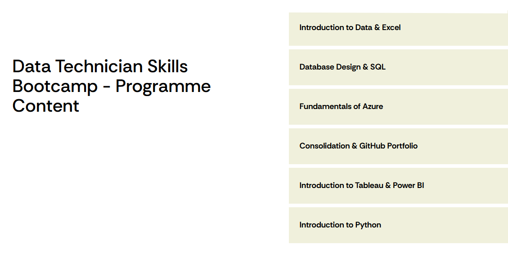

# Overall Reflection & Summary

Across the six weeks, I have developed a well-rounded foundation in data, technology, and digital systems. The programme progressed from data visualisation and dashboard design, to database management and SQL, into cloud computing and data protection legislation, and finally into programming with Python. Each week built upon the last, strengthening both my technical capability and my understanding of how data systems operate within real business environments.

I gained practical experience using tools such as Tableau and Power BI for visualisation, SQL for querying relational databases, Microsoft Azure for cloud-based data solutions, and Python libraries such as pandas and NumPy for programmatic analysis. Alongside the technical skills, I also developed a strong understanding of data governance, legal compliance, and structured data modelling, ensuring that I can approach data work responsibly and securely.

Overall, the bootcamp has significantly increased my confidence in handling data end-to-end — from collection and cleaning, to analysis, visualisation, and cloud storage. It has strengthened my analytical thinking, problem-solving ability, and technical discipline, while preparing me for roles in data, software, or technology-focused environments.

