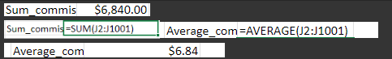
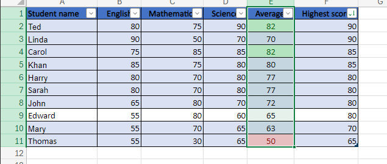
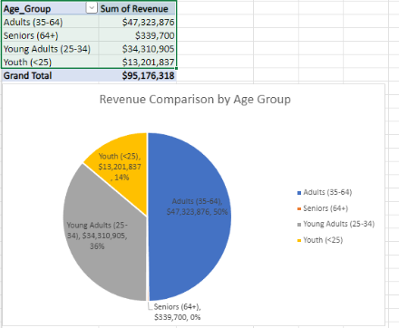
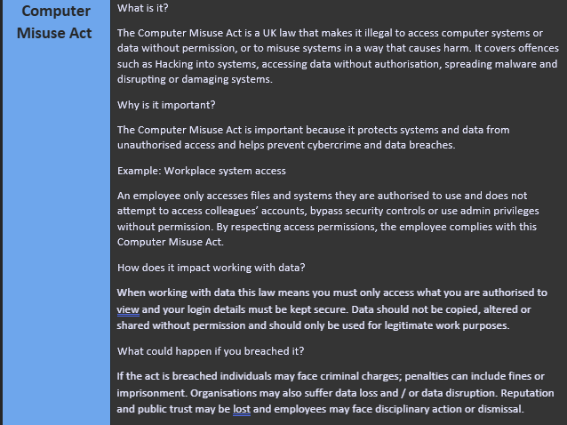

# Week 1 Summary

In **Week 1**, I developed foundational **Excel skills**, focusing on functions and formulas to perform calculations, organise datasets, and manipulate data efficiently. I gained confidence in navigating spreadsheets, structuring data correctly, and applying formulas to automate repetitive tasks and reduce manual errors.

### Key Learnings & Tools
* **Functions:** I practised using essential functions such as SUM, AVERAGE, IF, COUNT, and VLOOKUP to analyse datasets and extract meaningful information. I learned how logical functions support decision-making processes, and how lookup functions allow data to be retrieved across multiple tables. I also improved my understanding of relative and absolute cell referencing to ensure formulas worked accurately when copied across datasets.

* **Data Analysis:** I created and customised **PivotTables** to summarise large datasets efficiently. This allowed me to group, filter, and aggregate data to identify trends and patterns. I explored sorting, filtering, and basic data validation techniques to improve data accuracy and structure

* **Visualisation:** I designed charts and graphs, including bar charts, line graphs, and pie charts, to present insights clearly and effectively. I learned how to select appropriate visual formats based on the type of data and the message being communicated, improving my ability to transform raw data into understandable and visually engaging information.

* **Data Protection and Legal Frameworks** In addition to technical skills, I developed an understanding of key data protection laws and regulations. I explored the principles of the Data Protection Act 2018 and GDPR, focusing on lawful processing, data minimisation, and individuals’ rights regarding their personal data. I also gained awareness of the Freedom of Information Act (FOIA), which promotes transparency in public organisations, and the Computer Misuse Act, which addresses unauthorised access to computer systems and data. This helped me understand the legal and ethical responsibilities associated with handling and analysing data.

