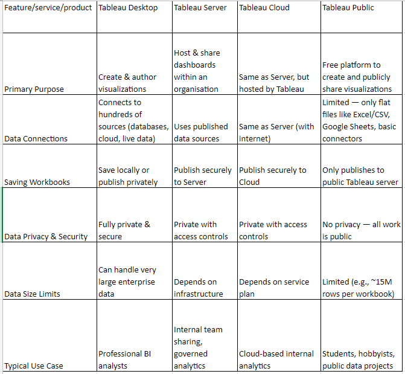
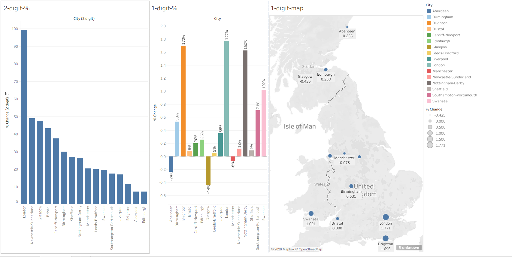
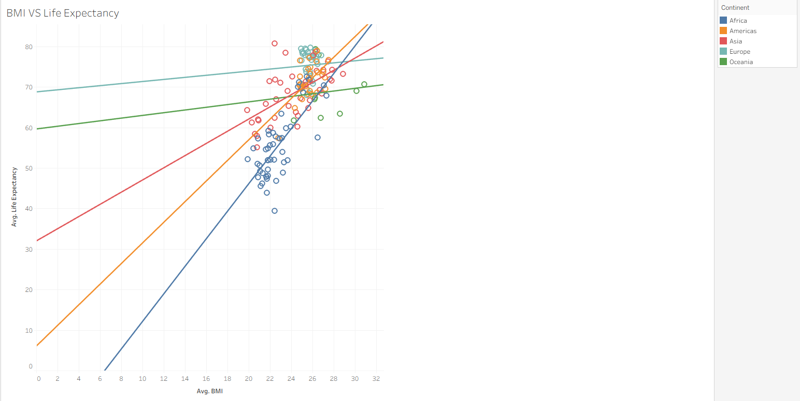
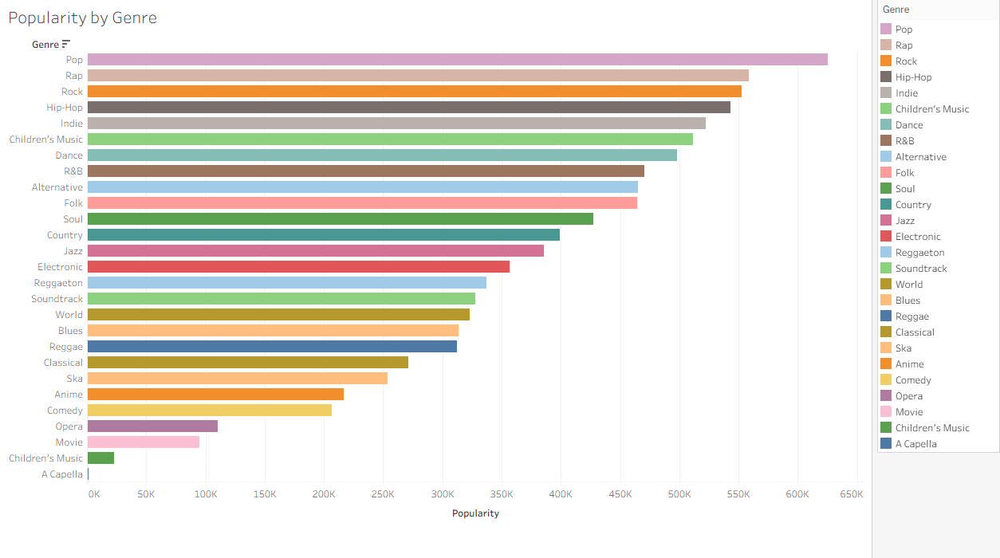
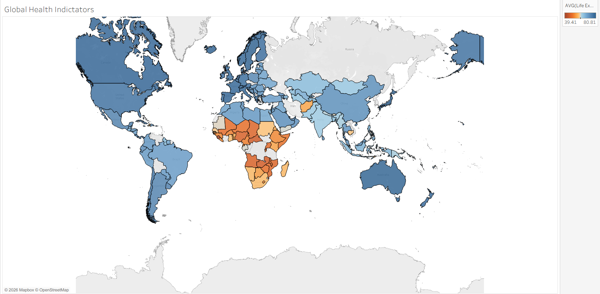

# Week 2 Summary
In Week 2, I developed my skills in **Tableau** and **Power BI**, focusing on creating advanced, interactive, and insight-driven visualisations. I explored how business intelligence tools can transform raw datasets into meaningful dashboards that support decision-making. This week strengthened both my technical dashboard-building skills and my ability to apply data storytelling techniques in real-world scenarios.

### Key Learnings & Skills
**Tableau Research & Platform Comparison:**
I researched the different versions of Tableau, comparing Tableau Desktop, Tableau Server, Tableau Online, and Tableau Public. I analysed their features, costs, and intended users, identifying the limitations of Tableau Public, particularly in relation to reduced functionality, restricted data connectivity, and the requirement to publish work publicly. This comparison improved my understanding of how organisations select business intelligence tools based on security, scalability, and functionality requirements.

**Dashboard Development & Visualisation:**
I created my own interactive Tableau dashboard, incorporating filters, calculated fields, and dynamic visual components. The dashboard included a bar chart displaying percentage change over time and a UK-based geographical map highlighting key city locations impacted by the dataset. This task strengthened my ability to choose appropriate visual formats to communicate trends effectively and ensure clarity for end users.

**Health Dataset Analysis:**
Using a health-related dataset, I conducted analysis to identify trends and key insights that could support organisational decision-making. I examined patterns across locations and time periods to determine areas requiring additional support or intervention. This task enhanced my ability to extract actionable insights from public sector data.

**Spotify Dataset Analysis:**
I also analysed a Spotify dataset to identify trends in music features and popularity metrics. By examining patterns in attributes such as genre, energy, and popularity, I identified insights that could inform future projects, marketing strategies, or content development decisions for an organisation. This strengthened my ability to interpret both numerical and categorical data within a business context.

**Data Storytelling & Professional Presentation:**
Throughout the week, I focused on designing dashboards that were not only technically functional but also visually clear and user-focused. I strengthened my ability to present complex information in a structured and engaging way, ensuring that insights were accessible to both technical and non-technical audiences.

**Power BI & Skillable Labs:**
In addition to Tableau, I completed structured labs in Skillable for Power BI, where I created reports and practised building interactive dashboards. I worked with data modelling features, relationships between tables, and report-level filters to produce professional business reports. This improved my understanding of how Power BI supports enterprise-level reporting and data-driven strategy.

