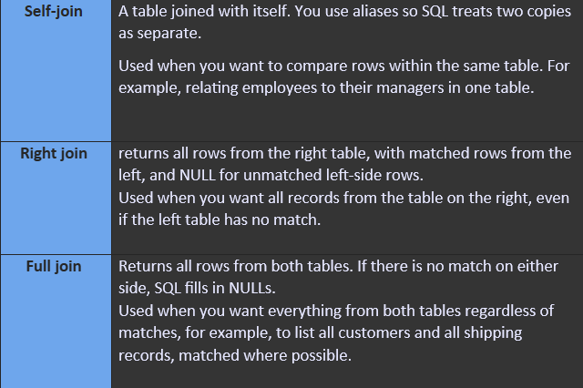
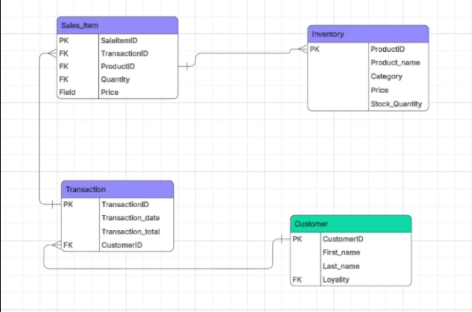

# Week 3 Summary

In Week 3, I developed a comprehensive understanding of **SQL** and core database management concepts. I strengthened my ability to write structured queries to retrieve, filter, sort, and organise data efficiently using SELECT statements, WHERE clauses, GROUP BY, ORDER BY, and various JOIN operations. This week focused not only on technical SQL skills but also on understanding how database design directly supports business operations and decision-making.

## Key Learnings & Projects

### SQL Proficiency & Query Development:
* I practised writing SQL queries to manipulate and analyse datasets effectively. This included using SELECT statements with conditional filtering, aggregation functions such as COUNT and AVG, and grouping techniques to summarise data. 
* I also researched and applied different types of JOINs (INNER JOIN, LEFT JOIN, RIGHT JOIN, and FULL JOIN), explaining what each provides and demonstrating examples of how they combine data across related tables. This strengthened my understanding of how relational databases maintain data integrity while enabling complex queries.
* As part of practical application, I completed 20 SQL tasks requiring data extraction and analysis. Examples included identifying cities with populations between 500,000 and 1,000,000, determining the country with the shortest life expectancy, and calculating average population by country. These exercises enhanced my confidence in handling real-world query scenarios and applying logical thinking to data problems.

### Database Concepts & Research Tasks:
* I researched and answered key conceptual questions relating to databases, including the role of primary and foreign keys in maintaining referential integrity. I explored relationships such as one-to-one, one-to-many, and many-to-many, and how these relationships influence database structure.
* Additionally, I examined the differences between relational and non-relational databases. I learned that relational databases use structured tables with defined schemas and relationships, making them ideal for transactional and structured data. In contrast, non-relational (NoSQL) databases are more flexible and better suited for unstructured or semi-structured data such as social media content, large-scale web applications, or rapidly changing datasets. This comparison deepened my understanding of when different database models are most appropriate.

### Database Design Essay – Retail Business Case Study:
* A major component of this week was completing an essay based on a small retail business (a local corner shop) seeking to streamline its operations by implementing a new database system. The proposed database was designed to manage inventory, sales transactions, customer records, and a loyalty programme.
* When designing the system, I considered the types of products typically sold in a convenience store and structured appropriate tables such as Products, Customers, Sales, Inventory, and Loyalty Accounts. I identified relevant primary keys and foreign keys to establish relationships between tables, ensuring accurate tracking of transactions and customer purchases. I also considered how

