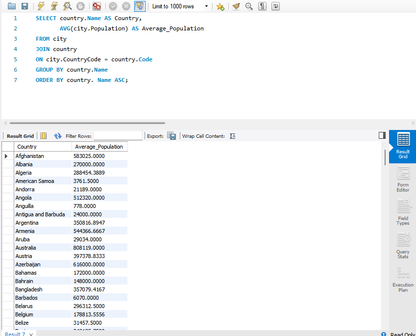

# Week 3 Summary

In **Week 3**, I developed my understanding of **SQL and database management** concepts. I learned how to write queries to retrieve, filter, and organise data efficiently using SELECT statements, joins, and conditional clauses.

### Key Learnings & Projects
* **SQL Proficiency:** Mastered writing queries with `SELECT` statements, `JOINs`, and conditional clauses to manipulate data.
* **Database Design:** Completed an essay on designing a database system for a small retail business to streamline operations.
* **Operational Streamlining:** Designed systems to manage **inventory, sales, and customer information** effectively.
* **Business Impact:** Strengthened my understanding of how relational databases and data structures support **business efficiency** and **decision-making**.

