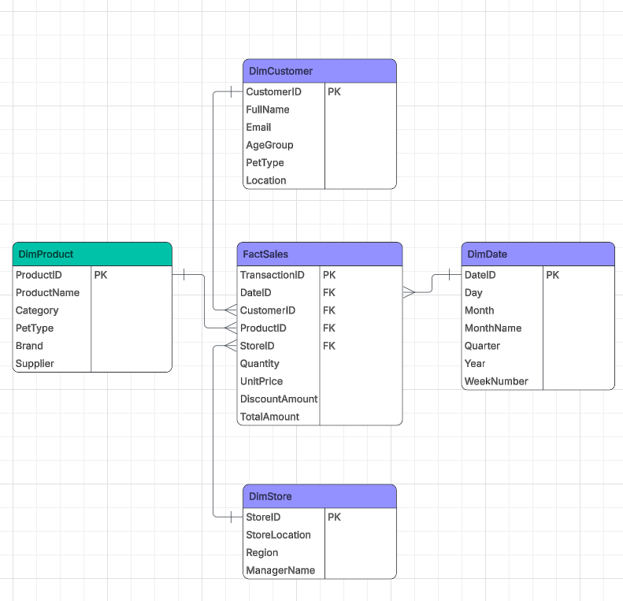

# Week 3 Summary

In **Week 3**, I developed my understanding of **data protection laws** and their importance in managing customer and business information responsibly. I explored key principles of data security, privacy, and compliance, alongside an introduction to **Microsoft Azure** and cloud-based data solutions.

### Key Projects & Learnings
* **Case Study Analysis:** Completed a 1500-word essay on "Paws & Whiskers," analyzing their transition from manual systems to **Microsoft Azure**.
* **Cloud Solutions:** Examined how cloud technology streamlines data storage, analysis, and reporting.
* **Data Governance:** Focused on ensuring data is stored and processed lawfully in accordance with **protection regulations**.
* **Strategic Impact:** Strengthened my understanding of how secure, scalable systems support **data-driven decision-making**.

# Schema for "Paws & Whiskers"

