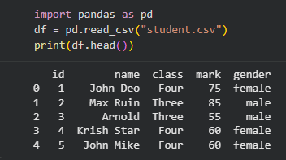
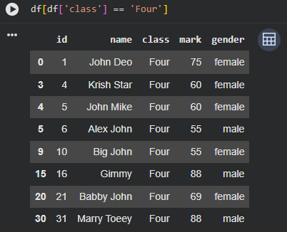
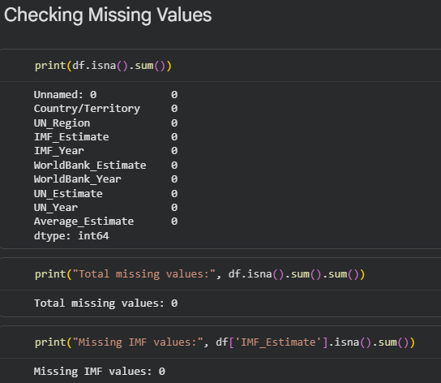
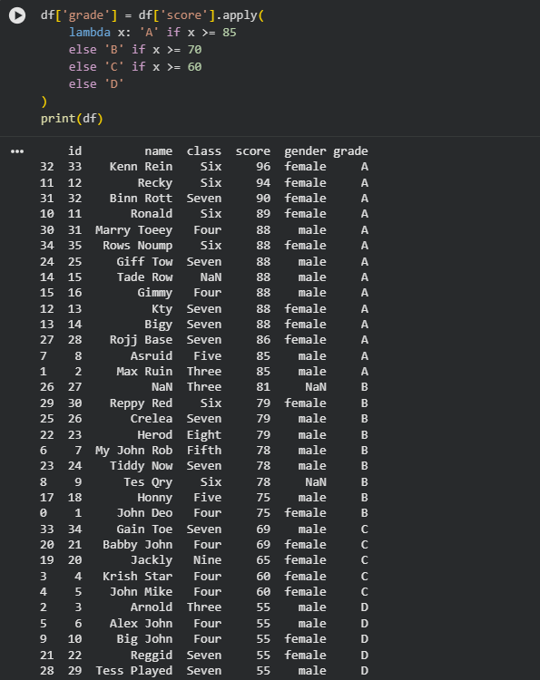
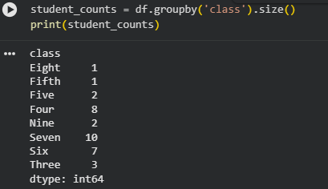
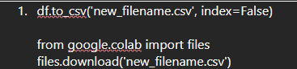

# Week 6 Summary
In Week 6, I developed my programming and data analysis skills using Python. The focus was on working with real datasets and applying analytical techniques using key libraries such as pandas, NumPy, and seaborn. I learned how to manipulate, clean, analyse, and visualise data efficiently using code, strengthening my ability to perform scalable and automated analysis.

### Key Learnings & Technical Skills

#### Core Python Programming
I began with foundational programming exercises, including completing the classic FizzBuzz task. This strengthened my understanding of:
* Loops
* Conditional statements
* Logical operators
* Modulus operations
This helped reinforce computational thinking and problem-solving skills before moving into data-focused tasks.

#### Loading and Exploring Data
Using pandas, I practised:
* Importing datasets (e.g., CSV files)
* Viewing dataset structure using .head(), .info(), and .describe()
* Understanding data types and column structures
This allowed me to assess dataset quality and identify potential issues before analysis.

#### Indexing and Slicing
I developed confidence using:
* Label-based indexing (.loc)
* Position-based indexing (.iloc)
* Row and column selection
* Filtering datasets using conditional logic
These skills enabled efficient data selection and transformation, which is essential when working with large datasets.

#### Data Cleaning
A major focus was ensuring data quality. I practised:
* Handling missing values
* Removing duplicates
* Renaming columns for consistency
* Converting data types
* Correcting inconsistencies
This reinforced the importance of clean data before performing analysis.

#### Data Manipulation
I worked on transforming datasets by:
* Creating new calculated columns
* Applying functions to columns
* Sorting and filtering values
* Performing arithmetic operations using NumPy
This improved my understanding of how raw data can be reshaped to extract meaningful insights.

#### Aggregation and Grouping
I learned how to summarise data using:
* .groupby() operations
* Calculating means, sums, counts, and other statistics
* Comparing grouped categories to identify trends
This allowed me to identify patterns within datasets and perform structured analytical comparisons.

#### Advanced Operations
I explored more advanced techniques, including:
* Merging and joining datasets
* Applying lambda functions
* Using conditional transformations
* Performing multi-level grouping
These tasks strengthened my ability to manage more complex data analysis workflows.

#### Data Visualisation
Using seaborn and matplotlib, I created statistical plots to visualise results, including:
* Bar charts
* Line graphs
* Distribution plots
This improved my ability to communicate findings clearly and support analysis with visual evidence.

#### Exporting Data
Finally, I practised exporting cleaned and processed datasets back to CSV format, ensuring results could be shared or reused in other tools.

